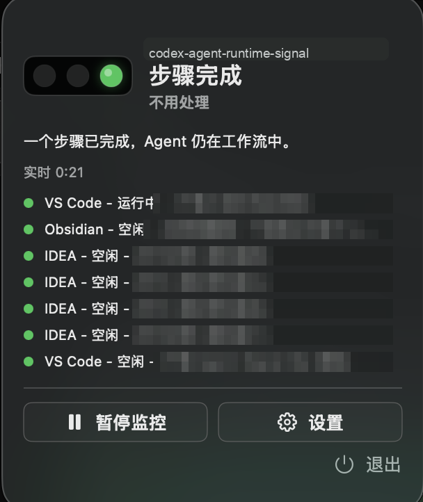
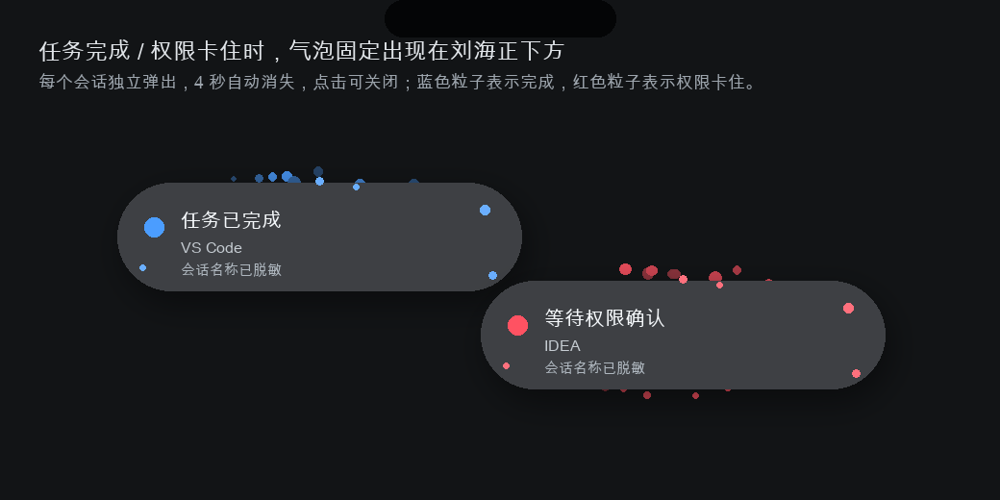

# codex-agent-runtime-signal

`codex-agent-runtime-signal` 是一个 macOS 菜单栏常驻工具，用来集中查看本机正在打开的 Codex / Claude / 本地 Agent 会话状态。它的目标是把“哪个 App 里的哪个会话正在跑、哪个会话已经空闲、哪个会话完成或卡权限了”直接放在菜单栏里，不需要反复切回终端、IDE 或桌面应用判断。

## 核心能力

- 一行展示一个已打开的 Codex 会话：`应用 - 运行中/空闲 - (会话名称)`。
- 自动识别 VS Code、IDEA、Xcode、Obsidian、OpenDesign、Codex Desktop、桌面终端等宿主应用。
- 会话名称优先使用 Codex `rename` / `resume` 列表里的名称；没有 rename 时使用默认首问名称。
- 只显示当前打开的会话，关闭的历史会话不会混进实时列表。
- 任务完成时在刘海正下方弹出胶囊气泡，带蓝色粒子和独立音效。
- 权限卡住时弹出红色粒子气泡，和完成提醒分开配置。
- 气泡 4 秒自动消失，点击可关闭；多个会话同时完成时自上而下堆叠显示。
- 菜单栏常驻低能耗设计：无悬浮窗、无重复运行页、轮询与 UI 刷新做了缓存和合并。
- 本地优先：状态文件、会话解析、诊断信息都保留在本机。

## 截图

### 运行情况

下面是真实运行情况截图，括号里的会话名称已做马赛克处理。



### 粒子气泡

完成和权限气泡是独立提醒路径，不复用菜单栏声音或旧提示逻辑。



## 状态语义

实时列表只保留两个判断用状态：

| 显示状态 | 含义 |
| --- | --- |
| `运行中` | 会话正在思考、执行工具、输出或处于活跃工作流 |
| `空闲` | 会话窗口仍打开，但当前没有思考或执行 |

聚合状态仍会在内部保留更细的信号，例如 `thinking`、`working`、`tool_done`、`done`、`permission`、`blocked`，用于菜单栏图标、气泡提醒和状态文件。

## 任务气泡

任务气泡只在明确事件发生时弹出：

| 类型 | 触发 | 粒子 | 默认声音 |
| --- | --- | --- | --- |
| 完成气泡 | 会话完成，不包含中断 | 蓝色 | Glass |
| 权限气泡 | 会话等待权限确认 | 红色 | Ping |

气泡内容包含三行：

```text
任务已完成 / 等待权限确认
应用名称
Codex 会话名称
```

如果多个会话同时完成，每个会话都会单独弹出一个气泡，并且每个完成事件都会响一次。设置页里可以分别调整完成气泡和权限气泡的音效，也可以关闭声音。

## 状态文件

默认状态文件：

```text
/tmp/codex-agent-runtime-signal/status.json
```

可用环境变量：

```bash
export CODEX_AGENT_RUNTIME_SIGNAL_STATE_FILE=/path/to/status.json
export CODEX_AGENT_RUNTIME_SIGNAL_STATE_DIR=/tmp/codex-agent-runtime-signal
export CODEX_AGENT_RUNTIME_SIGNAL_EVENT_LIMIT=50
export CODEX_AGENT_RUNTIME_SIGNAL_COMPLETED_TTL_SECONDS=90
```

## 构建

```bash
swift build
```

运行本地 App：

```bash
./script/build_and_run.sh
```

生成 macOS App：

```bash
./script/package_app.sh --release
```

生成 DMG / ZIP：

```bash
./script/package_release.sh
```

安装到当前用户 Applications：

```bash
./script/install_app.sh
```

## CLI

更新状态：

```bash
./scripts/codex-agent-runtime-signal working --session codex-main --agent codex --event PreToolUse
./scripts/codex-agent-runtime-signal done --session codex-main --agent codex --event Stop
./scripts/codex-agent-runtime-signal permission --session codex-main --agent codex --event PermissionRequest
```

读取状态：

```bash
./scripts/codex-agent-runtime-signal status
./scripts/codex-agent-runtime-signal status --json
```

包装本地命令：

```bash
./scripts/codex-agent-runtime-signal-run \
  --session local-build \
  --agent script \
  -- swift build
```

## Hooks

Codex hook：

```bash
./scripts/codex-signal-hook
```

Claude Code hook：

```bash
./scripts/claude-code-signal-hook
```

通用 JSON hook：

```bash
./scripts/generic-codex-agent-runtime-signal-hook
```

## 目录结构

```text
Sources/CodexAgentRuntimeSignal/          macOS 菜单栏 App
Sources/CodexAgentRuntimeSignalCore/      状态模型、解析器、聚合逻辑
Sources/CodexAgentRuntimeSignalUI/        菜单栏图标与灯效 UI
Sources/CodexAgentRuntimeSignalCLI/       codex-agent-runtime-signal CLI
scripts/                                   hook 与 CLI wrapper
script/                                    构建、打包、安装、诊断脚本
docs/                                     状态 schema、集成文档和截图资源
```

## 验证

常用验证命令：

```bash
swift build
./script/verify_local_integrations.sh
./script/verify_release_install.sh --dmg dist/CodexAgentRuntimeSignal.dmg
./script/verify_release_zip.sh --zip dist/CodexAgentRuntimeSignal.zip
```

当前本地环境可能无法执行 `swift test`，如果开发者工具链缺少 XCTest，会出现 `no such module 'XCTest'`。CI 环境应使用完整 Xcode toolchain。

## 许可

本项目使用 Apache-2.0 许可证。详见 [LICENSE](LICENSE)。
